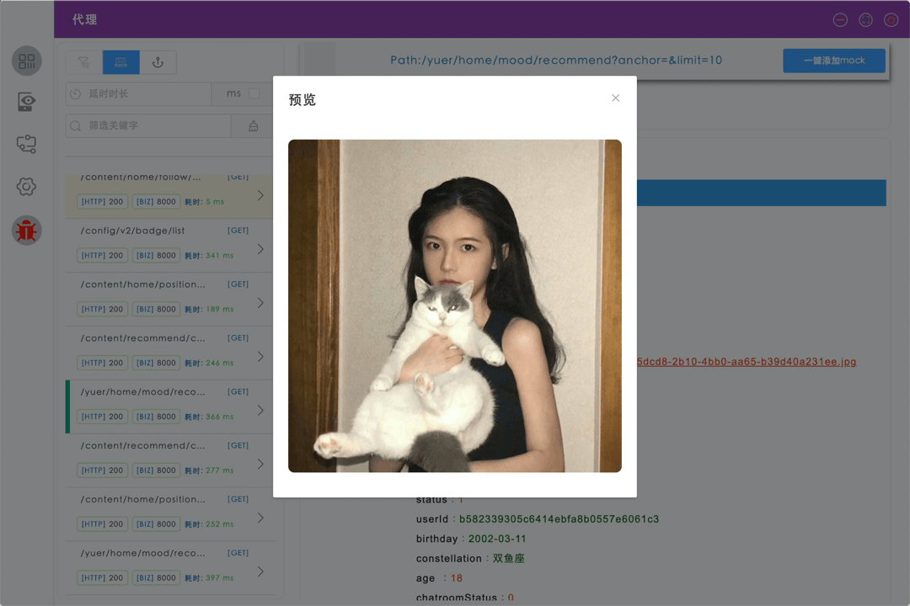

# app-mock-desktop

> 旨在推动前后端研发分离的效率小工具，方便前端（移动/PC/FE）同学在研发过程透过代理方便地查看请求数据/伪造数据/覆盖边界，结合接口设计可在前后端并行开发中通过数据伪造功能实现对API接口实现依赖的解耦，加速研发流程。

> 

### Build Setup

``` bash
# install dependencies
yarn

# serve with hot reload at localhost:9080
yarn dev

# build electron application for production
yarn build

```

### 接入指南
> 您的应用需对网络请求框架做一个简单改造，在所有需要接入AppMock的请求URL的Host的替换为AppMock提供的Host，同时将需代理请求的Header中添加

``` javascript
req.headers['mock-host'] = origin_host;
req.headers['mock-uid'] = mock_uid;
```

> 即完成应用端改造，其中origin_host为原请求的host，mock_uid为AppMock代理请求client的id。
> #### AppMock代理服务的地址获取方案
> + 移动端提供扫码获取Host SDK方便在研发过程中接入； :clock3: :x:
>     - android扫码组件； :clock3: :x:
>     - iOS扫码组件； :clock3: :x:
> + 桌面应用或Web应用需要研发同学根据自己的实际工程特点集成，一般建议在工程全局debug面板中添加集成入口统一替换；

### ***主体产品功能开发roadmap***
---
+ #### 工程框架重构 
    - 引入Typescript+Vuejs+ElementUI作为应用构建主体 :ok_hand: :heavy_check_mark:
    - 优化electron-vue脚手架，去除无用js向前兼容组件依赖 :ok_hand: :heavy_check_mark:
    - 优化webpack hot deploy在windows/mac环境下的重启实现 :ok_hand: :heavy_check_mark:
    - 升级Electron版本至8.1.0 :ok_hand: :heavy_check_mark:

+ #### 请求代理 2020.02.18
    - 主体功能实现，UI界面重绘 :ok_hand: :heavy_check_mark:
    - 主进程业务逻辑拆分： :ok_hand: :heavy_check_mark:

        由LocalServer拆分为ProxyService、MockService、PushService、WebService，服务依赖如下：
        > <kbd>LocalServer</kbd>
        >
        > <kbd>ProxyService</kbd>  <kbd>WebService</kbd>
        >
        > <kbd>PushService</kbd>  <kbd>MockService</kbd>
    
+ #### 数据伪造/本地化管理 2020.03.19
    + 引入PouchDB :ok_hand: :heavy_check_mark:
    + 完善MockService逻辑，增加延时设置支持 :ok_hand: :heavy_check_mark:
    + Mock数据管理页相关功能： 
        - 本地规则组创建/管理 :ok_hand: :heavy_check_mark:
        - 本地规则编辑/添加 :ok_hand: :heavy_check_mark:
        - 本地规则组代理开关 :ok_hand: :heavy_check_mark:
        
+ #### 支持网页版本 2020.08.18
    + 引入网页版本，应用可中心化部署，同学们可以通过网页版本更加便捷使用 :ok_hand: :heavy_check_mark:
        - 构建支持域名/IP两种模式部署，如果是域名部署，请在config.json文件中将domain指定为所需要绑定的域名；
    
+ #### 设置面板 :clock3:
    + 多网卡IP选择 :ok_hand: :heavy_check_mark:
    + 本地代理服务端口自定义 :ok_hand: :heavy_check_mark:
    + 本地推送端口自定义 :ok_hand: :heavy_check_mark:
    + 本地长连代理服务端口自定义 :clock3: :soon:
    + 支持Api定义服务指定 :ok_hand: :heavy_check_mark:
    + 支持买点规则服务指定 :ok_hand: :heavy_check_mark:
    + 支持代理数据服务指定 :ok_hand: :heavy_check_mark:
    + 在线设备查看 :ok_hand: :heavy_check_mark:

+ #### 数据模型测试数据自动化生成 :clock3: :x:

+ #### 多数据协议支撑 :clock3:
    + JSON :ok_hand: :heavy_check_mark:
    + protobuf :clock3: :x:
    + thrift :clock3: :x:
    + 私有协议plugin支撑 :clock3: :x:
